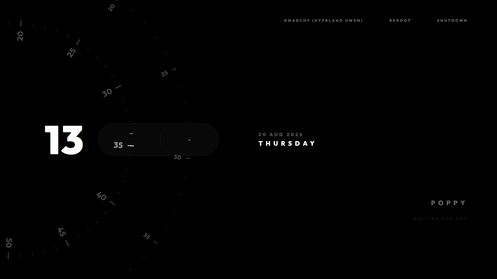

# Orbital SDDM Theme

A sleek, beautiful, clock-focused SDDM login theme extracted from the [Ryoku-Arch](https://github.com/neur0map/ryoku-arch) operating system.

This theme features a stunning live orbital clock and a clean, minimalist design for your display manager.

> **Note:** This theme is written purely in **Qt6**. Ensure your distribution uses the Qt6 version of SDDM before installing (most modern distributions like Arch and its derivatives do).

## Preview


## Requirements
Any Linux distribution can use this theme, as long as it uses the modern **Qt6** build of SDDM. You will need the following packages installed on your system (names may vary slightly by distribution):
- `sddm`
- `qt6-declarative`
- `qt6-5compat` (provides backwards compatibility for GraphicalEffects)

## Installation

### Quick Installation (One-Command)
Clone the repository and run the included install script:
```bash
git clone https://github.com/Rizmi/orbital-clock-sddm.git
cd orbital-clock-sddm
sudo ./install.sh
```

### Manual Installation
1. Clone this repository to your local machine:
   ```bash
   git clone https://github.com/Rizmi/orbital-clock-sddm.git
   ```
2. Copy the `orbital` folder into your system's SDDM themes directory:
   ```bash
   sudo cp -r orbital-clock-sddm/orbital /usr/share/sddm/themes/
   ```
3. Set the theme as your default in your SDDM configuration. Open your SDDM config file (usually `/etc/sddm.conf` or a file in `/etc/sddm.conf.d/`) and ensure the `[Theme]` section looks like this:
   ```ini
   [Theme]
   Current=orbital
   ```

## Testing the Theme
You can preview the theme without logging out by running:
```bash
sddm-greeter-qt6 --test-mode (or sddm-greeter if your distro links it to Qt6) --theme /usr/share/sddm/themes/orbital
```

## Credits
All credit for the original design and QML code goes to the creators of the [Ryoku-Arch project](https://github.com/neur0map/ryoku-arch) and their [qylock](https://github.com/Darkkal44/qylock) lockscreen implementation.
